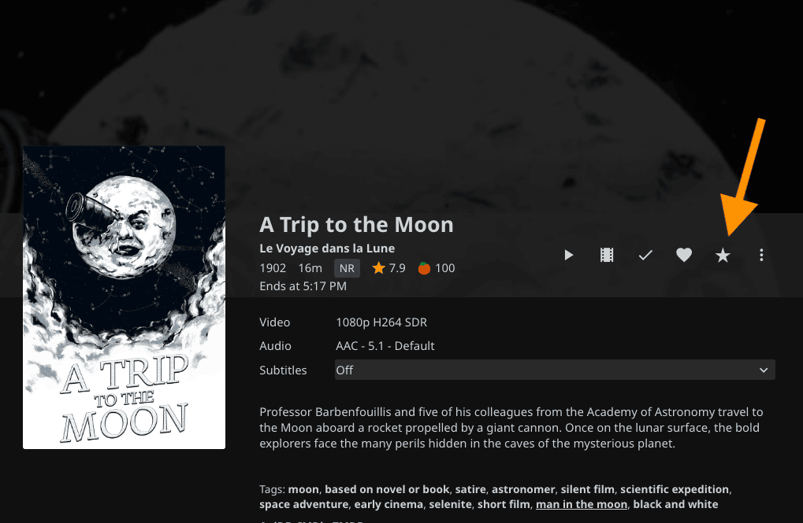

# Jellyfin Letterboxd Link

A simple Jellyfin plugin that provides a link to a movie's [Letterboxd](https://letterboxd.com) page. No
accounts, no background tasks, minimal external API dependence.

It resolves the link from the movie's TMDb id via Letterboxd's `letterboxd.com/tmdb/{id}/` redirect, and
injects the button via the
[File Transformation](https://github.com/IAmParadox27/jellyfin-plugin-file-transformation)
plugin. See
[CONTRIBUTING.md](CONTRIBUTING.md) for further technical information.

The Letterboxd link (★) appears as a button alongside the existing actions on a movie's
detail page, and as an entry in the "more" (⋮) menu on movie posters and banners in list views:

## Requirements

- Jellyfin server ≥ **10.11.x**
- The [File Transformation](https://github.com/IAmParadox27/jellyfin-plugin-file-transformation)
  plugin, installed and enabled.

## Installation

1. **Install [File Transformation](https://github.com/IAmParadox27/jellyfin-plugin-file-transformation)
   first** and confirm it's enabled. Follow the install
   instructions in their [`README`](https://github.com/IAmParadox27/jellyfin-plugin-file-transformation#installation).
2. Install this plugin, either:
   - **Add as a repository**: in Jellyfin, go to Dashboard → Plugins → Repositories → Add
     Repository, and add
     `https://briggsyj.github.io/jellyfin-letterboxd-link/manifest.json`.
     Then find "Letterboxd Link" under Catalog and install it.
   - **Manual zip install**: download the latest release zip from
     [Releases](../../releases) and unzip it into a `LetterboxdLink` folder
     under your Jellyfin
     [plugins directory](https://jellyfin.org/docs/general/server/plugins/#adding-plugin-repositories).
3. Restart Jellyfin.

To build from source instead, see [CONTRIBUTING.md](CONTRIBUTING.md).

## Contributing

Bug reports, fixes, and small improvements are welcome - see
[CONTRIBUTING.md](CONTRIBUTING.md) for dev setup, tests, and the release
process.

## License

[GPL-3.0](LICENSE).

## Affiliation

No affiliation with Jellyfin or Letterboxd.
